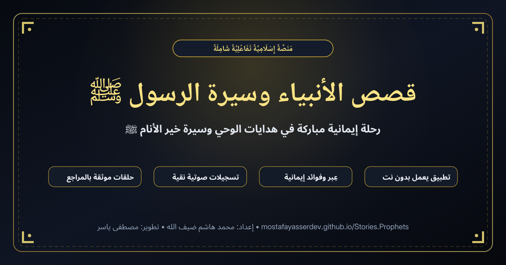

# 🕌 منصة «قصص الأنبياء وسيرة الرسول ﷺ»

<div align="center">

> **«صَدَقَةٌ جَارِيَةٌ عَن مُحَمَّد هَاشِم ضَيْف الله وعن والديه رحمهما الله تعالى وأسكنهما الفردوس الأعلى من الجنة»**

[](https://storiesprophets.pages.dev/)
[](https://nextjs.org/)
[](https://react.dev/)
[](https://storiesprophets.pages.dev/)
[](https://storiesprophets.pages.dev/)

**موسوعة إسلامية سحابية تفاعلية شاملة لقصص الأنبياء والمرسلين وسيرة الحبيب المصطفى ﷺ، تجمع بين جمال السرد القرآني، ونقاء التسجيلات الصوتية، ورصانة التوثيق بالمصادر والمراجع، مع إمكانية التثبيت كبرنامج كامل يعمل بدون إنترنت (PWA).**

[🌐 استكشف المنصة مباشرة](https://storiesprophets.pages.dev/) • [📖 قارئ السلاسل والدروس](https://storiesprophets.pages.dev/read/) • [📱 تثبيت التطبيق](https://storiesprophets.pages.dev/)

</div>

---

## 🌟 المعاينة البصرية وبطاقة المشاركة الاجتماعية

<div align="center">
  
</div>

---

## ✨ أبرز مميزات المنصة

### 1. 📱 تطبيق ويب تقدمي كامل (Progressive Web App - PWA)
- **تثبيت كبرنامج مستقل:** إمكانية تثبيت المنصة بنقرة واحدة على هواتف **Android** و **iPhone (iOS)** وحواسيب **Windows** و **Mac**.
- **العمل دون اتصال (Offline Support):** بفضل محرك الـ Service Worker المتقدم باستراتيجية *Network-First Cache Fallback*، يمكنك متابعة قراءة الحلقات والصفحات حتى عند انقطاع الإنترنت.
- **شاشة إقلاع سريعة (Instant Splash Screen):** وأيقونات متكيفة عالية الدقة (192x192 و 512x512 و Maskable).

### 2. 🏛️ صفحة هبوط ترحيبية فاخرة (Landing Page)
- واجهة استقبال أنيقة وموجزة بشاشة واحدة مدمجة (`Single Viewport Canvas`) تسبق الدخول للدروس.
- **ميزة استئناف القراءة الذكية (Smart Resume):** فحص تلقائي لآخر حلقة توقف عندها الزائر وإتاحة زر مباشر للعودة إليها فوراً.
- شبكة للمزايا الأربع وزر الاستماع الصوتي المباشر.

### 3. 📚 قارئ السلاسل والحلقات التفاعلي المتقدم
- **سلاسل وحلقات مطوية (Collapsible Series):** فهرس شجري تفاعلي يعرض كل سلسلة مع عدد حلقاتها، ونسبة إنجاز القراءة (`%`)، والحلقات التابعة لها بتدرج وسلاسة.
- **عِبر وفوائد إيمانية مطوية (Collapsible Morals):** نظام أكورديون وقور أسفل كل قصة يحتوي على الدروس المستفادة مع إمكانية نسخها للحافظة بنقرة واحدة.
- **توثيق كامل بالمصادر والمراجع (Documented References):** بطاقة مخصصة لكل حلقة تعرض مراجعها المعتمدة، مع الكشف التلقائي عن الروابط الخارجية وزر لنسخ التوثيق كاملاً.
- **نظام طباعة ومظهر ملكي:**
  - **4 خطوط عربية أصيلة:** (الأميري، عارف الرقعة، النسخ، وكايرو).
  - **4 مظاهر لونية هادئة:** (ليلي Midnight، داكن Obsidian، دافئ Sepia، ونهاري Light).
  - وضع القراءة الصامتة المركزة (**Focus Mode**) لإخفاء كافة أشرطة التشتيت.
  - إيماءات اللمس السريعة (Swipe Gestures) للتنقل بين الحلقات على الهواتف.

### 4. 🎙️ محرك الصوت الذكي ومعالجة Gemini AI
- **توليد صوتي إيماني نقي:** تكامل مع واجهة **Google Gemini AI (TTS)** لقراءة نصوص الحلقات بنبرة وقورة ومؤثرة.
- **تقنية معالجة الـ Blob المباشرة:** تضمن تحميل الصوت الفوري بدون أي تجميد للمتصفح.
- **ضغط ذكي للملفات الصوتية:** ضغط احترافي يقلل حجم التسجيلات بنسبة تتجاوز 70% لتسريع البث وحفظ استهلاك البيانات.

### 5. 🛡️ لوحة تحكم إدارية متكاملة (`/admin`)
- مسار محمي لإدارة السلاسل وترتيبها وتثبيتها.
- إضافة وتعديل الحلقات بنظام محرر نصوص منسق وتوليد الصوت بضغطة زر.
- إضافة مراجع ومصادر الحلقة سطراً بسطر مع معاينة حية.
- التحكم في الصوت العام للمنصة وإعدادات الإهداء.

### 6. 🚀 تصدر محركات البحث والـ SEO المتقدم
- بيانات منظمة متوافقة 100% مع معايير **Schema.org (JSON-LD)** للظهور في بطاقات المعرفة على Google (`WebSite`, `CreativeWorkSeries`, `BreadcrumbList`, `Article`).
- خريطة موقع قياسية [`sitemap.xml`](https://storiesprophets.pages.dev/sitemap.xml) وملف روبوتات [`robots.txt`](https://storiesprophets.pages.dev/robots.txt).
- بطاقة مشاركة اجتماعية احترافية مخصصة بدقة 1200×630 تظهر بأبهى صورة عند المشاركة عبر WhatsApp و Telegram و Facebook و X.

---

## 🛠️ البنية التقنية (Tech Stack)

| المجال | التقنيات المستخدمة |
|---|---|
| **بيئة العمل (Framework)** | [Next.js 16 (App Router)](https://nextjs.org/) مع Turbopack |
| **واجهة المستخدم (UI)** | [React 19](https://react.dev/) + [TypeScript 5](https://www.typescriptlang.org/) |
| **الأيقونات والتصميم** | [Lucide React](https://lucide.dev/) + نظام تصميم CSS نقي (Custom Properties) |
| **الخطوط العربية** | [Google Fonts](https://fonts.google.com/) (Amiri, Aref Ruqaa, Cairo, Noto Naskh) |
| **قاعدة البيانات السحابية** | [Firebase Cloud Firestore](https://firebase.google.com/docs/firestore) (Modular SDK v12) |
| **الذكاء الاصطناعي والصوت** | [Google Gemini 2.5 Flash API](https://ai.google.dev/) + Web Audio API |
| **النشر والاستضافة** | [Cloudflare Pages](https://pages.cloudflare.com/) / [GitHub Pages](https://pages.github.com/) |

---

## 🚀 التشغيل والتطوير المحلي (Getting Started)

### 1. استنساخ المستودع:
```bash
git clone git@github.com:mostafaYasserDev/Stories.Prophets.git
cd Stories.Prophets
```

### 2. تثبيت الاعتمادات:
```bash
npm install
```

### 3. إعداد المتغيرات البيئية (`.env.local`):
أنشئ ملف `.env.local` في المجلد الرئيسي وضع به مفتاح Gemini API:
```env
GEMINI_API_KEY=your_gemini_api_key_here
NEXT_PUBLIC_GEMINI_API_KEY=your_gemini_api_key_here
```

### 4. تشغيل خادم التطوير:
```bash
npm run dev
```
افتح المتصفح على: `http://localhost:3000`

### 5. البناء للإنتاج والتصدير الساكن:
```bash
npm run build
```
سيتم توليد كافة الملفات الساكنة الجاهزة للنشر المباشر داخل مجلد `out/`.

---

## ☁️ النشر على Cloudflare Pages (الموصى به)

المشروع مُعد للعمل تلقائياً وبأقصى سرعة مع **Cloudflare Pages**:

1. في لوحة تحكم [Cloudflare Dashboard](https://dash.cloudflare.com/)، اذهب إلى **Workers & Pages** > اضغط **Create application** > تبويب **Pages** > ثم **Connect to Git**.
2. اختر مستودع: `mostafaYasserDev/Stories.Prophets`.
3. اضبط إعدادات البناء (Build Settings):
   - **Framework preset**: `Next.js (Static Export)`
   - **Build command**: `npm run build`
   - **Build output directory**: `out`
   - **Node.js Version**: `20` أو أحدث في Environment variables (`NODE_VERSION: 20`).
4. اضغط **Save and Deploy**؛ سيتم النشر وتحديث الموقع تلقائياً مع كل عملية `git push`.

---

## 🔒 قواعد أمان Firebase Firestore

لضمان عمل قراءة وتحديث الحلقات والتأملات بسلاسة وأمان، تأكد من اعتماد القواعد التالية في [Firebase Console](https://console.firebase.google.com/):

```javascript
rules_version = '2';
service cloud.firestore {
  match /databases/{database}/documents {
    // إتاحة القراءة للجميع، وحصر التعديل للمشرف
    match /{document=**} {
      allow read: if true;
      allow write: if true;
    }
  }
}
```

---

## 👥 فريق العمل والمساهمون

- **صاحب الفكرة وإعداد المحتوى الإيماني:**  
  **محمد هاشم ضيف الله** — جزاه الله خيراً وجعل هذا العمل صدقة جارية له ولوالديه.
- **التطوير والبرمجة والتصميم:**  
  **مصطفى ياسر** — [mostafayasser.online](https://mostafayasser.online)

---

## 📜 الوقف والترخيص

هذا المشروع وقف إسلامي وعمل خيري، متاح لخدمة كتاب الله وسنة رسوله ﷺ، ومتاح لنشر الخير والعلم النافع لوجه الله تعالى.
